``` 
    _   __              _                  ______                                 __             
   / | / /__  __ _____ (_)____   ____     / ____/____   ____  _   __ ___   _____ / /_ ___   _____
  /  |/ // / / // ___// // __ \ / __ \   / /    / __ \ / __ \| | / // _ \ / ___// __// _ \ / ___/
 / /|  // /_/ /(__  )/ // /_/ // / / /  / /___ / /_/ // / / /| |/ //  __// /   / /_ /  __// /    
/_/ |_/ \__,_//____//_/ \____//_/ /_/   \____/ \____//_/ /_/ |___/ \___//_/    \__/ \___//_/     
                                                                                                
```

Nusion is a Web app to convert nodes between Foundry's Nuke and Blackmagic Design's Fusion Studio compositing software.

## Screenshot


## Supported Notes
Lots of supported nodes are on the way!

Nuke to Fusion

- Blur
- Transform
- Invert
- Premult
- Unpremult
- ColorCorrect (Coming soon!)

Fusion to Nuke

- (Coming soon!)

## Example Nuke Node Snippet

To test the nusion web app, you can copy/paste the following Nuke blur node snippet:

    Blur {
     inputs 1+1
     size 4
     name car_Dust_Blur
     xpos 950
     ypos 1330
    }

## License

- [MIT](https://choosealicense.com/licenses/mit/) Open-Source License

## Nusion Installation

### Requirements

- [Python](https://www.python.org/)
- [pip](https://pip.pypa.io/en/stable/)
- [Node.js](https://nodejs.org/en/)
- [NPM](https://www.npmjs.com/get-npm/)

### Windows Install:

Let's use the Winget package manager to install NodeJS / NPM in the Command Prompt window:

```bash
winget install OpenJS.NodeJS
```

Python 3.13 can be installed using Winget in the Command Prompt window:

```bash
winget install python.python.3.13
```

git can be installed using Winget in the Command Prompt window:

```bash
winget install git.git
```

Create a new Python virtual environment:

```bash
cd %USERPROFILE%
python -m venv nusion
%USERPROFILE%/nusion/Scripts/activate.bat
```

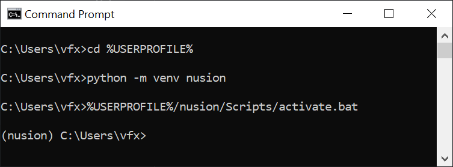

Clone the repo, and install the dependencies using the Python pip package manager:

```bash
python -m pip install --upgrade pip
pip install flask
cd %USERPROFILE%
git clone https://github.com/AndrewHazelden/NusionConverter.git
cd %USERPROFILE%/NusionConverter/
pip install -r requirements.txt
```

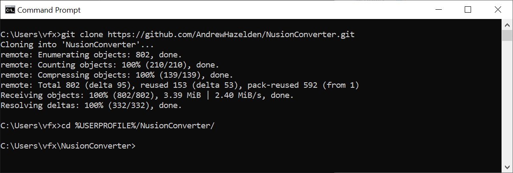

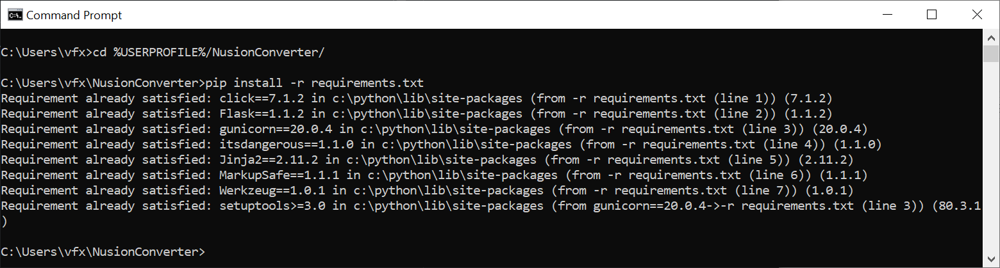

Activate the Python virtual environment and start the Flask app:

```bash
%USERPROFILE%/nusion/Scripts/activate.bat
cd %USERPROFILE%/NusionConverter/app
flask run
```

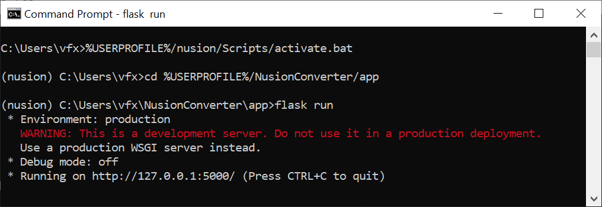

Open a webbrowser session to view the web app:

```bash
start http://127.0.0.1:5000/
```

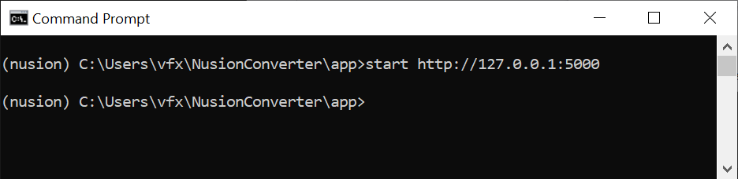

### macOS Install:

Install a recent version of Python 3.x from the official [Python org website](https://www.python.org/downloads/).

Install the Homebrew package manager:

```bash
/bin/bash -c "$(curl -fsSL https://raw.githubusercontent.com/Homebrew/install/HEAD/install.sh)"
echo >> $HOME/.zprofile
echo 'eval "$(/opt/homebrew/bin/brew shellenv)"' >> HOME/.zprofile
eval "$(/opt/homebrew/bin/brew shellenv)"
```
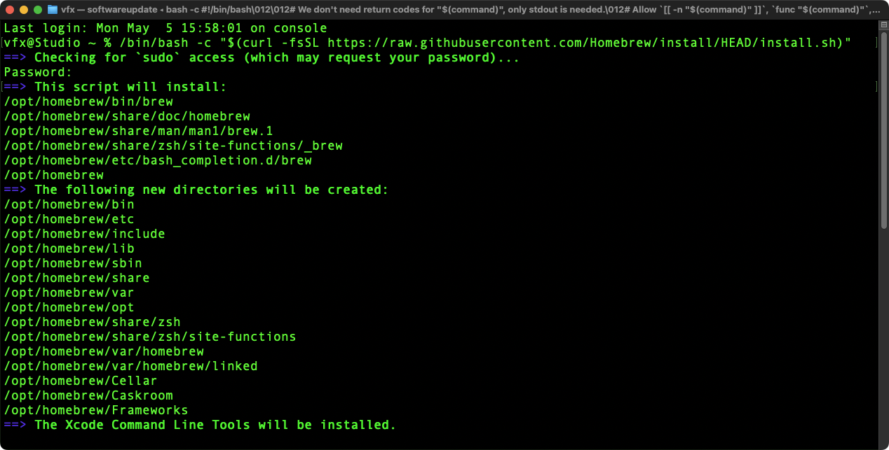

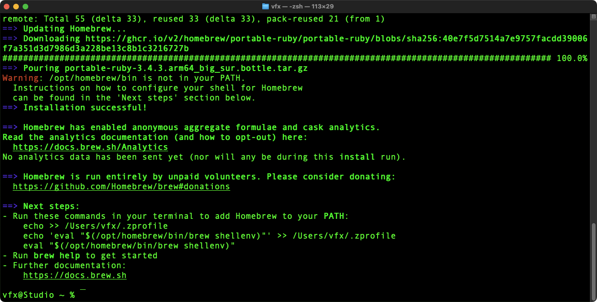

Create a new Python virtual environment:

```bash
cd $HOME/
python3 -m venv nusion
source $HOME/nusion/bin/activate
```

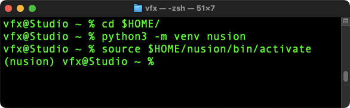

Clone the repo and install the dependencies using Homebrew and Python pip package managers:

```bash
brew install npm
pip3 install --upgrade pip
pip3 install flask
cd $HOME/
git clone https://github.com/AndrewHazelden/NusionConverter.git
cd $HOME/NusionConverter/
pip3 install -r requirements.txt
```

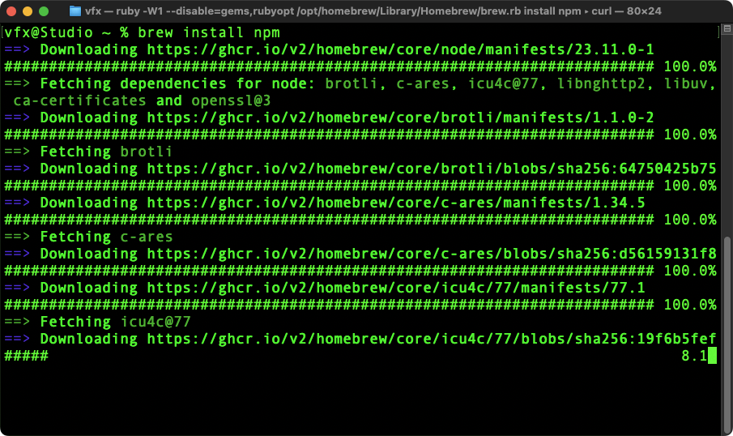

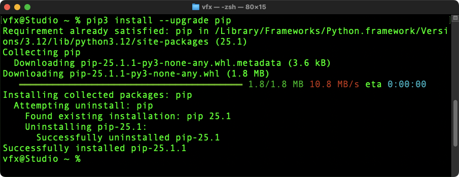

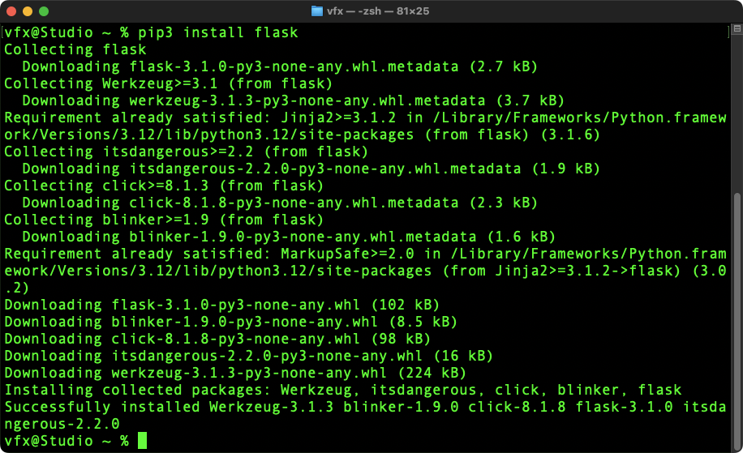

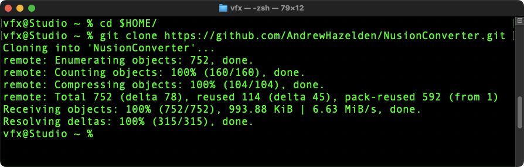


Activate the Python virtual environment and start the Flask app:

```bash
source $HOME/nusion/bin/activate
cd $HOME/NusionConverter/app
flask run
```

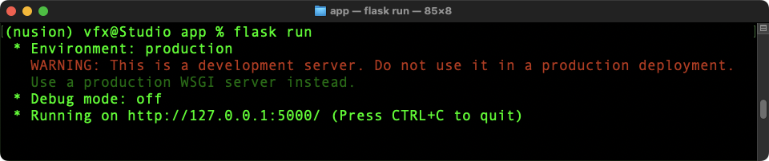

Open a webbrowser session to view the web app:

```bash
open http://127.0.0.1:5000/
```
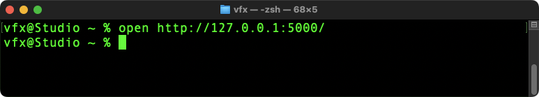

## cURL Usage

The Nusion Web app can use cURL from the terminal to process JSON encoded Nuke scripts.

The Nuke node data is stored in a "data" JSON key that is submitted by cURL via an HTTP post request.

```bash
curl 'http://127.0.0.1:5000/convert' -X POST -H 'Accept: */*' -H 'Accept-Encoding: gzip, deflate, br, zstd' -H 'Referer: http://127.0.0.1:5000/' -H 'Content-Type: application/json' -H 'Origin: http://127.0.0.1:5000' -H 'Connection: keep-alive' --data-raw '{"data":"Blur {\n inputs 1+1\n size 4\n name car_Dust_Blur\n xpos 950\n ypos 1330\n}","width":"1920","height":"1080","fromSoftware":"nuke"}'
```

cURL Terminal Result:

The Fusion formatted node data can be accessed using the "result" JSON key.

```json
{"result":"{\nTools = ordered() {\ncar_Dust_Blur = Blur {\nInputs = {\nXBlurSize = Input { Value = 1.43561, },\n},\nViewInfo = OperatorInfo {\nPos = { 950, 1330 },\n},\n}\n}\n}"}
```

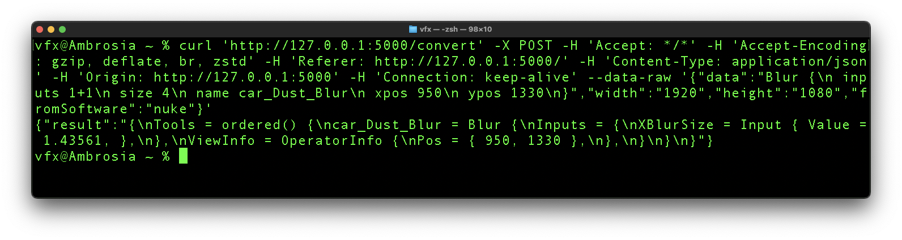

## BMD Fusion Studio Usage

If you have Blackmagic Fusion Studio, the "Paste Nusion" menu entry and Lua comp script allows you to convert a Foundry Nuke .nk node snippet into a BMD Fusion Studio native node.

There is a beta version of a "Paste Nusion" Reactor atom package available from the NusionConvert GitHub repository.


### Paste Nusion Usage: 

1. Start the Nussion Web app in a terminal window.
2. Copy your Nuke node snippet into your clipboard buffer.
3. Open Fusion Studio. Run the "Edit > Paste Nusion" menu item to automatically convert the nodes, and add them to your currently open Fusion comp.

### Paste Nusion Installation:

The "Paste Nusion" script is accesible in the NusionConverter GitHub repo under the folder:

- Atoms/com.AndrewHazelden.PasteNusion/


To manually install the PasteNusion atom package files:
1. Install NusionConvert from the GitHub repo.
2. Copy the "Config" folder contents into your "Reactor:/Deploy/Config/" folder.
3. Copy the "Scripts/Comp" folder contents into your "Reactor:/Deploy/Scripts/Comp/" folder.

