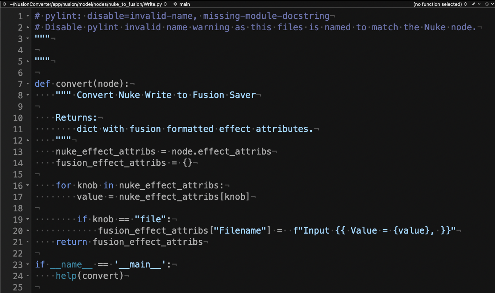
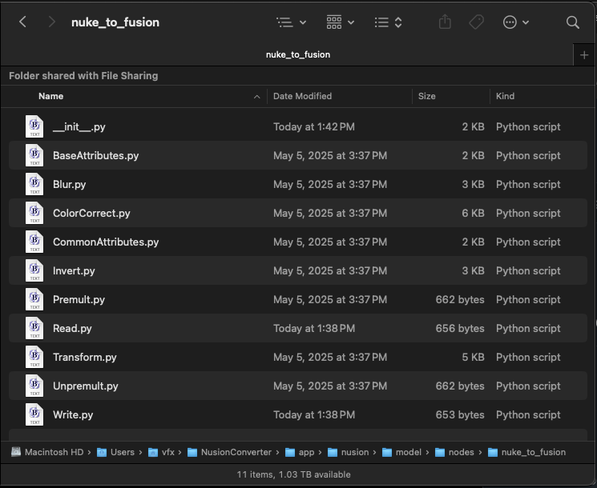
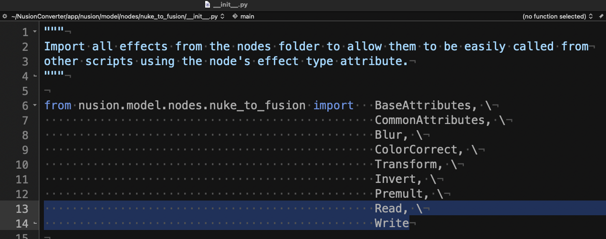
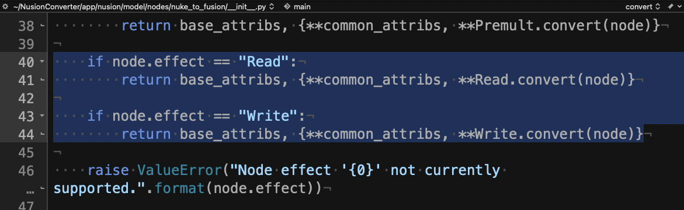
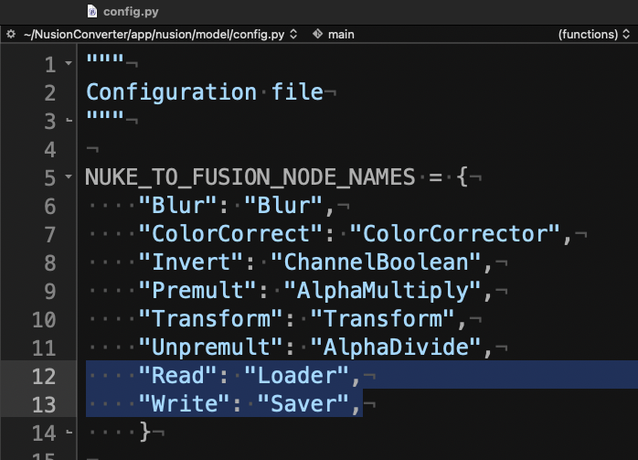
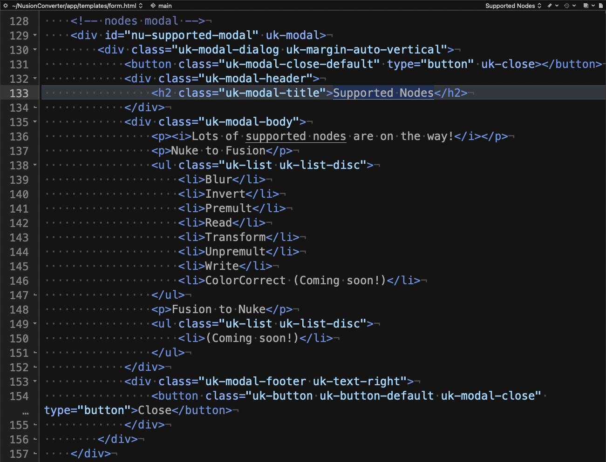

# Add Support for New Nodes

One of Nusion's most powerful features is that you can add support for additional Nuke nodes with only a few small changes to the included Python scripts. This makes it possible to map any Nuke node to a corresponding Fusion native node, OpenFX plugin, FusionSDK plugin, DCTL, Fuse, or potentially to a custom Fusion macro.

## Create a new Node Entry

1. Start by creating a new Python script that has a filename prefix that matches the Nuke node name you want to add support for:

        app/nusion/model/nodes/nuke_to_fusion/<node-name>.py

For example, if the Nuke node name is "Write", then the Python script would be called "Write.py".



To make this task easier, there are existing node definition scripts in the "nuke_to_fusion" folder that you can copy and adapt.



2. Nusion needs to be told to look for the newly added "&lt;node-name&gt;.py" python script. This is done by looking in the "nuke_to_fusion" folder and editing the "\_\_init\_\_.py" file. The file is located at:

        app/nusion/model/nodes/nuke_to_fusion/__init__.py

Start by adding the Nuke node name to the end of the import items on this line:

```py
from nusion.model.nodes.nuke_to_fusion import   BaseAttributes, \
```



Lower down in the script, in the "def convert(node)" section we can add an extra "node.effect" entry for the Nuke node that we want to add support for.

```py
if node.effect == "Write":
    return base_attribs, {**common_attribs, **Write.convert(node)}
```

When defining the attributes for the node.effect entry, take a note how the "**Write.convert(node)" parameter is telling Nusion to look in the corresponding "&lt;node-name&gt;.py" python file, and to run the script's "convert()" function.



3. Update the config.py file to define how the node names are mapped during the conversion process:

        app/nusion/model/config.py

Edit the "NUKE_TO_FUSION_NODE_NAMES = {" section to add the mapping from the original Nuke node name to the appropriate Fusion node name:

```py
"Write": "Saver",
```



## Update the HTML Docs

Finally, you can edit the Nusion Web app's HTML code to indicate the node is now a supported node type. The file is located at:

        app/templates/form.html

Look for the HTML code that starts on the line and then add your node to the list:

```html
<h2 class="uk-modal-title">Supported Nodes</h2>
```


