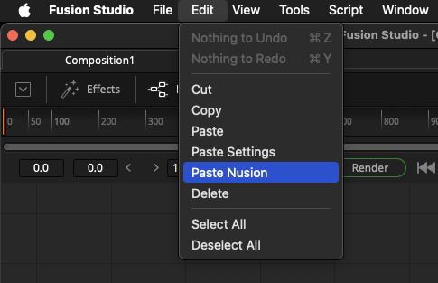
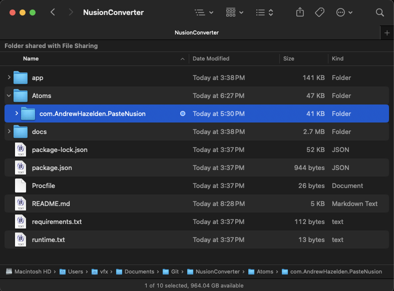

# Nusion for BMD Fusion Studio

If you have Blackmagic Fusion Studio, the "Paste Nusion" menu entry and Lua comp script allows you to convert a Foundry Nuke .nk node snippet into a BMD Fusion Studio native node.

There is a beta version of a "Paste Nusion" Reactor atom package available from the NusionConvert GitHub repository.

### Paste Nusion Usage: 

1. Start the Nussion Web app in a terminal window.
2. Copy your Nuke node snippet into your clipboard buffer.
3. Open Fusion Studio. Run the "Edit > Paste Nusion" menu item to automatically convert the nodes, and add them to your currently open Fusion comp.

### Now Available in Reactor

The "Paste Nusion" integration for Fusion can be installed using Reactor. Look for it in the Reactor "Scripts/Comp" category with a package name of "Paste Nusion". 

Note: You will still need to add the Nusion web app to your system which is Python based.

### Paste Nusion Manual Installation:

The "Paste Nusion" script is accesible in the NusionConverter GitHub repo under the folder:

- Atoms/com.AndrewHazelden.PasteNusion/

To manually install the PasteNusion atom package files:
1. Install NusionConvert from the GitHub repo.
2. Copy the "Config" folder contents into your "Reactor:/Deploy/Config/" folder.
3. Copy the "Scripts/Comp" folder contents into your "Reactor:/Deploy/Scripts/Comp/" folder.

